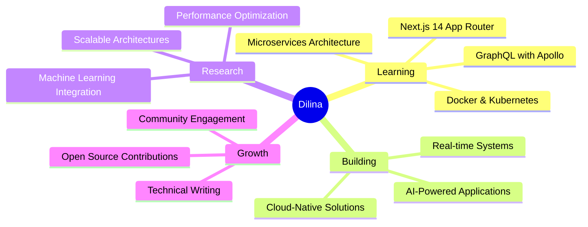

# H.P.G Dilina Mewan

<div align="center">
  
  
  
  <br/>
  
  
  
  <br/>
  
  
  
</div>

<br/>

## 🎯 Professional Summary

<div align="center">

```typescript
const dilina = {
    identity: {
        name: "H.P.G Dilina Mewan",
        role: "Software Engineering Student",
        location: "Colombo, Sri Lanka 🇱🇰",
        availability: "Open to opportunities"
    },
    education: {
        university: "NSBM Green University",
        degree: "BSc in Software Engineering",
        gpa: "3.85/4.0",
        year: "Final Year"
    },
    expertise: {
        domains: ["Full-Stack Development", "AI/ML Integration", "Cloud Architecture"],
        passion: ["Building scalable systems", "AI-powered solutions", "Modern web tech"],
        motto: "Code with purpose, build with passion"
    },
    currentGoals: [
        "🎓 Excel in final year project with AI focus",
        "☁️ Master cloud-native architectures",
        "🚀 Contribute to open-source projects",
        "📚 Deep dive into microservices patterns"
    ]
};
```

</div>

<br/>

## 💻 Technology Stack

<div align="center">

### Frontend Excellence


### Backend Mastery


### Mobile Innovation


### Data & Cloud


### AI & Intelligence


</div>

<br/>


## 📊 GitHub Performance Metrics

<div align="center">
  
  
  
  
  
  
  
  

</div>

<br/>

## 🏆 Achievements & Recognition

<div align="center">

| 🎯 Achievement | 📋 Details |
|:---:|:---|
| 🎓 **Academic Excellence** | Maintained 3.85/4.0 GPA throughout software engineering degree |
| 🐍 **Python Certified** | Advanced programming proficiency certification |
| 🔧 **WSO2 Training** | Completed intensive Linux and DevOps fundamentals training |
| 🌐 **Full-Stack Portfolio** | Successfully delivered 6+ production-ready web applications |
| 🤖 **AI Research Focus** | Conducting advanced AI integration research for final year project |
| 🏏 **Sports & Balance** | Active cricket and chess player promoting work-life balance |

</div>

<br/>

## 🎯 Current Focus Areas

<div align="center">



</div>

<br/>

## 📈 Coding Activity

<div align="center">

<!--START_SECTION:waka-->
<!--END_SECTION:waka-->

</div>

<br/>

## 🤝 Let's Connect

<div align="center">
  
  <a href="mailto:dilinamewan07@gmail.com">
    
  </a>
  <a href="https://www.linkedin.com/in/dilina-mewan-a9528a205/">
    
  </a>
  <a href="https://github.com/DilinaMewan">
    
  </a>
  
  <br/><br/>
  
  **📧 dilinamewan07@gmail.com** · **📍 Colombo, Sri Lanka** · **🎓 Software Engineering Student**
  
  <br/>
  
  

</div>

<br/>

<div align="center">
  
  ### 💡 *"Innovation distinguishes between a leader and a follower."* — Steve Jobs
  
  <sub>⭐ Star my repositories if you find them interesting!</sub>
  
  
  
</div>
