# H.P.G Dilina Mewan

<div align="center">
  
  <!-- Elegant Header with Subtle Animation -->
  
  
  <!-- Sophisticated Typing Animation -->
  
  
  <br>
  
  <!-- Minimalist Counter -->
  
  
</div>

---

<div align="center">
  
## 🎭 **Digital Craftsman** 

*Where code meets creativity, and innovation drives impact*

</div>

```typescript
interface DeveloperProfile {
  readonly identity: {
    name: "H.P.G Dilina Mewan";
    location: "Colombo, Sri Lanka 🇱🇰";
    timezone: "GMT+5:30";
    languages: ["English", "Sinhala"];
  };
  
  readonly education: {
    university: "NSBM Green University";
    program: "Software Engineering";
    year: "Final Year";
    gpa: 3.85;
    achievements: ["Academic Excellence", "Research Focus: AI Integration"];
  };
  
  readonly expertise: {
    primary: ["Full-Stack Development", "AI Integration", "System Architecture"];
    exploring: ["Cloud Native Applications", "DevOps Culture", "Modern Web Patterns"];
    passionate_about: "Building scalable solutions that solve real problems";
  };
  
  readonly currentMission: {
    focus: "AI-powered applications for final year capstone project";
    learning: "React ecosystem mastery + ASP.NET Core architecture";
    building: "Next-generation web applications with intelligent features";
    vision: "Bridging the gap between AI capabilities and user experience";
  };
}
```

---

<div align="center">
  
## ⚡ **Technology Stack**

*Mastering the tools that shape the digital future*

</div>

### **Frontend Engineering**
<div align="center">
  
  
  
  
  
  
  
</div>

### **Backend Architecture**
<div align="center">
  
  
  
  
  
  
</div>

### **Mobile & Cross-Platform**
<div align="center">
  
  
  
  
</div>

### **Data & Cloud Infrastructure**
<div align="center">
  
  
  
  
  
  
</div>

### **AI & Machine Learning**
<div align="center">
  
  
  
  
  
</div>

---

<div align="center">
  
## 🚀 **Featured Projects**

*Innovation through code, impact through design*

</div>

<table align="center">
<tr>
<td align="center" width="50%">

### 🚘 **Car Auction Platform**
**Real-time Bidding Ecosystem**

`ASP.NET Core` • `SQL Server` • `SignalR` • `TypeScript`

Advanced auction system featuring live bidding, secure payments, and real-time notifications with WebSocket architecture.

[**🔗 View Project**](#) • [**📋 Documentation**](#)

</td>
<td align="center" width="50%">

### 🧠 **ALEX AI Chatbot**
**Intelligent Conversation Engine**

`Python` • `Google Gemini API` • `NLP` • `Threading`

Sophisticated chatbot with natural language processing, multithreading capabilities, and context-aware responses.

[**🔗 View Project**](#) • [**🤖 Demo**](#)

</td>
</tr>
<tr>
<td align="center" width="50%">

### 🚍 **Shuttle Tracker**
**Smart Transport Solution**

`Flutter` • `PHP` • `MySQL` • `Google Maps API`

University transport tracking with GPS integration, route optimization, and predictive arrival times.

[**🔗 View Project**](#) • [**📱 App Store**](#)

</td>
<td align="center" width="50%">

### 💊 **Pulse Med App**
**Healthcare Management Platform**

`Flutter` • `Firebase` • `Health APIs` • `AI Recommendations`

Comprehensive medication management with health monitoring, emergency features, and AI-powered insights.

[**🔗 View Project**](#) • [**🏥 Case Study**](#)

</td>
</tr>
</table>

---

<div align="center">
  
## 📊 **Development Analytics**

*Data-driven insights into my coding journey*

</div>

<div align="center">
  
  <!-- GitHub Stats with Custom Styling -->
  
  

</div>

<div align="center">
  
  <!-- Activity Graph with Modern Theme -->
  

</div>

<div align="center">
  
  <!-- Contribution Streak -->
  

</div>

---

<div align="center">
  
## 🏆 **Achievements & Recognition**

*Building expertise through continuous learning*

</div>

<div align="center">

| **🎓 Academic Excellence** | GPA 3.85/4.0 • Final Year Software Engineering |
|:--:|:--|
| **🐍 Python Proficiency** | Advanced Programming Language Certification |
| **🔧 DevOps Foundation** | WSO2 Training • Linux & Cloud Fundamentals |
| **🌐 Full-Stack Mastery** | 6+ Production-Ready Web Applications |
| **🤖 AI Research Focus** | Machine Learning Integration Specialist |
| **🎯 Leadership Skills** | Team Collaboration & Project Management |

</div>

---

<div align="center">
  
## 🔮 **Current Focus Areas**

*Shaping the future through strategic learning*

```mermaid
graph LR
    A[🎯 Current Mission] --> B[AI Integration]
    A --> C[Modern Web Development]
    A --> D[Cloud Architecture]
    
    B --> B1[Machine Learning APIs]
    B --> B2[Intelligent UX Patterns]
    
    C --> C1[React 18 & Next.js 14]
    C --> C2[Advanced TypeScript]
    
    D --> D1[Docker & Kubernetes]
    D --> D2[AWS Services]
    
    style A fill:#4F46E5,stroke:#7C3AED,stroke-width:3px,color:#fff
    style B fill:#EC4899,stroke:#BE185D,color:#fff
    style C fill:#06B6D4,stroke:#0891B2,color:#fff
    style D fill:#10B981,stroke:#059669,color:#fff
```

</div>



---

<div align="center">
  
## 🌐 **Let's Connect**

*Building the future together, one conversation at a time*

</div>

<div align="center">
  
  [](mailto:dilinamewan07@gmail.com)
  [](https://www.linkedin.com/in/dilina-mewan-a9528a205/)
  [](https://github.com/DilinaMewan)
  [](#)
  
  <br><br>
  
  **📧 dilinamewan07@gmail.com** • **🌍 Colombo, Sri Lanka** • **🎓 Software Engineering Student**
  
</div>

---

<div align="center">
  
## 🎨 **Philosophy**

> *"Technology is best when it brings people together and solves real problems.  
> I believe in writing code that not only functions flawlessly  
> but also creates meaningful experiences for users."*

**— Dilina Mewan**

</div>

---

<div align="center">
  
  <!-- Elegant Footer -->
  
  
  
  
  **⭐ If my work resonates with you, consider starring my repositories! ⭐**
  
</div>
